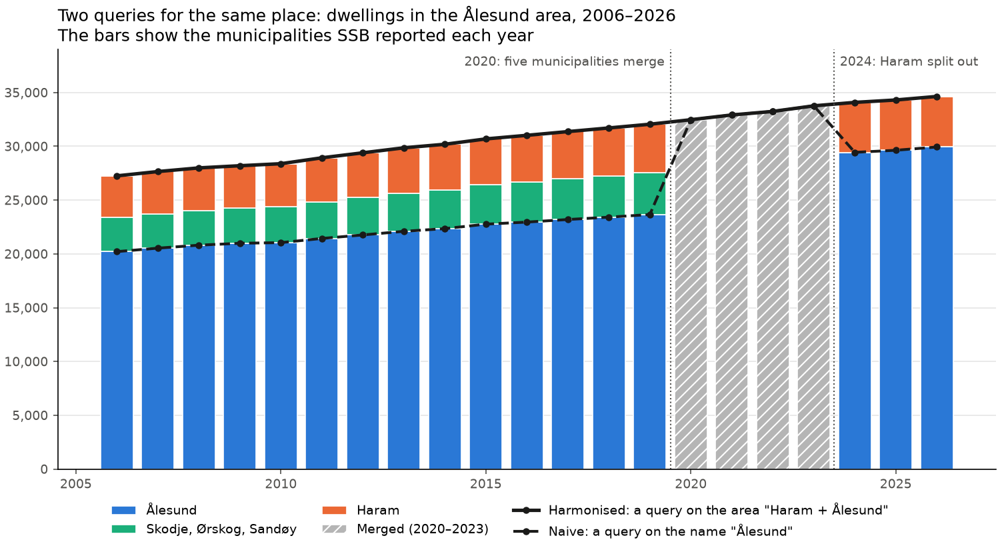
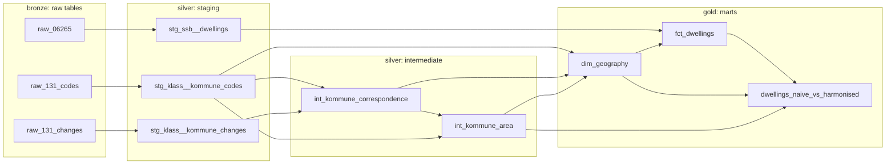
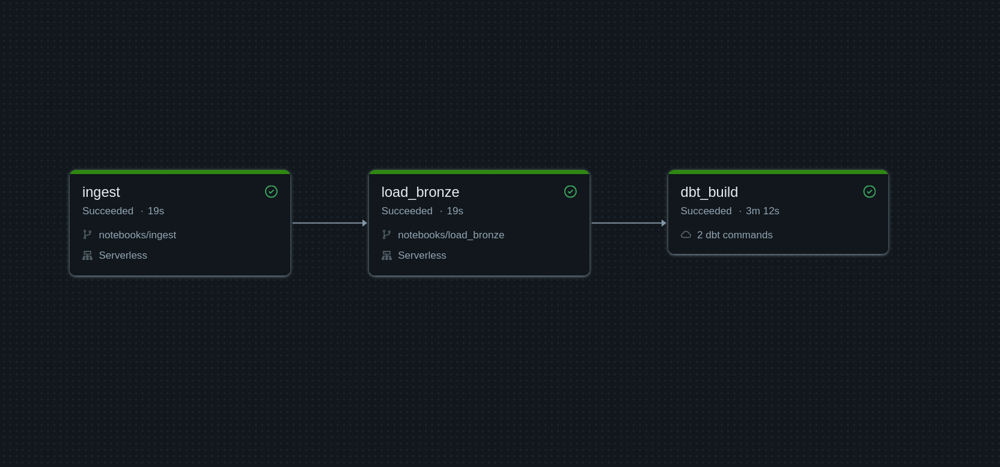

# Norwegian housing data warehouse

**History that does not break when the map changes.**

A dimensional data warehouse on open data from Statistics Norway (SSB), built with
dbt on Databricks. It tracks the number of dwellings (_boliger_: houses, flats
and other homes) in every Norwegian municipality (_kommune_) from 2006 to 2026,
and keeps each time series continuous through the municipal mergers of 2020 and
the renumbering and split of 2024.

`dbt` · `Databricks SQL / Delta Lake / Unity Catalog` · `Databricks Workflows` ·
`GitHub Actions` · `SCD type 2` · `star schema` · `Python` · `SSB PxWebApi + Klass API`

**What this project demonstrates:**

- **dbt:** layered models (staging → intermediate → marts) in medallion schemas
  (silver, gold) on top of bronze sources, packages, tests and documentation
  persisted to Unity Catalog.
- **Dimensional modelling:** a fact table and a slowly changing dimension
  (SCD type 2): a dimension that keeps every historical version of a
  municipality with the dates each version was valid.
- **Data quality as contracts:** tests that reconcile with SSB's national total
  and check that nothing is counted twice.
- **Orchestration and CI:** one Databricks job runs the whole chain from API to
  marts, and GitHub Actions runs `dbt build` against separate CI schemas on every
  push to `main` and every pull request.
- **Working with real public data:** two SSB APIs, and source gaps documented
  instead of hidden.
- **Documented decisions:** six architecture decision records with the
  alternatives that were rejected.

## The problem

Norway has redrawn its municipal map several times. In 2020, 119 municipalities
were merged into 47, and in 2024, 114 got new codes. SSB reports each year's
figures under the code that was valid that year, so a time series on the raw
codes breaks every time the map changes.

Ålesund shows both ways a series can break:

- **2020, merger:** Ålesund (code `1504`) was merged with its neighbours Haram,
  Sandøy, Skodje and Ørskog into a new, larger Ålesund (`1507`).
- **2024, split:** Haram was split out again, so `1507` became Ålesund (`1508`)
  and Haram (`1580`).

Following "Ålesund" in the raw data shows a jump of 37% in 2020 and a drop of
13% in 2024, even though nothing close to that was built or torn down:

| Year | Code   | Raw: "Ålesund" | Harmonised: Haram + Ålesund |
| ---- | ------ | -------------: | --------------------------: |
| 2019 | `1504` |         23,658 |                      32,053 |
| 2020 | `1507` |         32,473 |                      32,473 |
| 2023 | `1507` |         33,764 |                      33,764 |
| 2024 | `1508` |         29,440 |                      34,084 |

## The solution

The warehouse builds a **harmonised** series: the same geographic area in every
year, no matter which codes its figures were reported under. For Ålesund, that
area is the five municipalities that merged in 2020. Before 2020, their five
figures are summed. From 2020 to 2023, the area is `1507`. From 2024, it is
`1508` + `1580`. The result is steady growth of about 1% a year.

Note that SSB changed how it defines a dwelling in 2012, so figures before and
after are not fully comparable. That is a break in method, not in geography,
and harmonisation does not address it.

Why "Haram + Ålesund" and not Ålesund alone? From 2020 to 2023, SSB reported only
the merged municipality, so how many of those dwellings were in Haram is not
known. Instead of guessing, the warehouse keeps the two together as one stable
area. The series is built only from exact SSB figures, and nothing is counted
twice.



The chart compares two queries for the same place:

- **Naive (dashed):** ask for the name "Ålesund". You get whichever municipality
  had that name each year (`1504`, then `1507`, then `1508`), so the line jumps
  at every boundary change.
- **Harmonised (solid):** ask for the area "Haram + Ålesund" (`area_code`
  `1508` in `dim_geography`). You get the sum of every municipality that has
  ever been part of the area: the top of the bars, continuous from 2006 to
  today.

The bars show what the harmonised series is made of. Haram is visible before
2020 and from 2024, but from 2020 to 2023 it is hidden inside the merged
municipality (grey). For municipalities that never changed, such as Oslo, the
two queries return the same series.

The chart is made by [`scripts/plot_alesund_area.py`](scripts/plot_alesund_area.py),
which queries the star schema (`fct_dwellings` joined with `dim_geography`).

## How it works

The municipality changes come from SSB's classification API (Klass). The
warehouse rebuilds the full history from it:

1. **Which municipalities existed, and when.** Klass's code list gives every
   version of every code with its validity window. That is the SCD type 2
   dimension `dim_geography`, with one row per code version.
2. **Who became whom.** Klass's change list gives one-step edges
   (`1534 → 1507`, `1507 → 1580`). A recursive model follows them to today's codes.
3. **Point-in-time join.** Each dwelling figure is matched to the version of its
   code that was valid that year, and gets that version's surrogate key.
4. **Stable areas for splits.** Municipalities that share a history, like
   Ålesund and Haram, are grouped into one area. The mart
   `dwellings_naive_vs_harmonised` sums the dwellings per area and year.

The mart holds a harmonised and a naive series for every area. Its naive series
is the strictest naive query, today's codes only, so it is empty for the years
before those codes existed (`1508` and `1580` before 2024). The chart above uses
a query on the name instead, because that shows the jumps.



## Pipeline

One Databricks job ([`jobs/nor_housing_pipeline.yml`](jobs/nor_housing_pipeline.yml))
runs the chain from the APIs to the marts. Each task starts only if the one
before it succeeded:



1. **`ingest`** ([`notebooks/ingest.py`](notebooks/ingest.py)) calls the SSB and
   Klass APIs through [`fetch_ssb.py`](fetch_ssb.py) and
   [`fetch_klass.py`](fetch_klass.py) and writes each response untouched to a
   Unity Catalog Volume. The task is retried up to twice if it fails, for example
   when SSB is slow to answer.
2. **`load_bronze`** ([`notebooks/load_bronze.py`](notebooks/load_bronze.py))
   turns the files into bronze tables. SSB's JSON-stat format stores the values
   as one flat list, with the labels kept separately per dimension, so it is
   unpacked into one row per cell.
3. **`dbt_build`** runs `dbt deps` and `dbt build`: staging and intermediate
   models in `silver`, marts in `gold`, and every test.

The job runs the code on `main` straight from GitHub. It runs on demand, with no
schedule, because the project is not in operation.

**CI:** a [GitHub Actions workflow](.github/workflows/dbt_build.yml) runs
`dbt build` on every push to `main` and every pull request. It reads the real
bronze data but writes only to its own `ci` and `ci_gold` schemas, never to the
production tables. A [`generate_schema_name`](norwegian_housing_dwh/macros/generate_schema_name.sql)
override keeps the plain medallion names in production and the prefixed names in
CI.

## Tests as contracts

Generic tests check the grain and keys of the models (`unique`, `not_null`,
`unique_combination_of_columns`) and the foreign key from the fact to the
dimension. Three custom tests check what the project promises:

- [`assert_harmonised_total_matches_fct_dwellings`](norwegian_housing_dwh/tests/assert_harmonised_total_matches_fct_dwellings.sql):
  the harmonised total equals the fact total every year, so nothing is counted
  twice.
- [`assert_fct_dwellings_reconciles_with_ssb_total`](norwegian_housing_dwh/tests/assert_fct_dwellings_reconciles_with_ssb_total.sql):
  the fact reconciles with SSB's national total, so no rows are lost silently.
  Two source gaps are documented and accepted
  ([ADR-0004](docs/adr/0004-accept-known-source-gaps-in-fct-dwellings.md)):
  Svalbard, which is not a municipality, and Harstad and Bjarkøy in 2013, where
  SSB published the figures under the old codes. The Harstad area therefore
  shows 0 dwellings in 2013 instead of about 12,000.
- [`assert_kommune_area_is_closed`](norwegian_housing_dwh/tests/assert_kommune_area_is_closed.sql):
  no historical code belongs to more than one stable area. The areas are built
  in one step, by grouping today's codes that share a historical code. A longer
  chain of splits would break that, and the test would catch it.

Every model, column and source is described in YAML, and the model and column
descriptions are written to Unity Catalog as table and column comments, so they
are visible in Databricks too.

## Design decisions

Each significant choice is recorded as an architecture decision record (ADR),
with the alternatives that were rejected:

| ADR                                                                                    | Decision                                                                                  |
| -------------------------------------------------------------------------------------- | ----------------------------------------------------------------------------------------- |
| [0001](docs/adr/0001-count-instead-of-price.md)                                        | Model a count (dwellings), not a price: counts add up across a merger, prices do not      |
| [0002](docs/adr/0002-regular-model-instead-of-snapshot.md)                             | A regular model, not a dbt snapshot, for SCD type 2: Klass already holds the full history |
| [0003](docs/adr/0003-recursive-correspondence-model.md)                                | A recursive model to resolve historical codes to today's codes                            |
| [0004](docs/adr/0004-accept-known-source-gaps-in-fct-dwellings.md)                     | Accept two known source gaps, guarded by a reconciliation test                            |
| [0005](docs/adr/0005-harmonise-split-kommuner-into-stable-areas.md)                    | Group split municipalities into stable areas instead of estimating                        |
| [0006](docs/adr/0006-end-the-klass-change-window-before-the-2026-border-adjustment.md) | Leave out the 2026 border adjustment, which the correspondence model cannot represent     |

## Running it

Requires a Databricks workspace (Free Edition works) and Python 3.14, the version
CI runs.

**In Databricks:** create the catalog `nor_housing` with the schema `bronze` and
the volume `ssb`, then create the job from
[`jobs/nor_housing_pipeline.yml`](jobs/nor_housing_pipeline.yml), either in the
Jobs UI or as a Databricks Asset Bundle resource. Set `warehouse_id` to your own
SQL warehouse, and `git_url` to your fork if you change the code. Running the
job fetches the data and builds everything.

**Locally**, to develop and test the dbt models against the same workspace:

```bash
python -m venv .venv && source .venv/bin/activate
pip install -r requirements-dbt.txt

cp .env.example .env              # host (without https://), HTTP path, token
set -a && source .env && set +a

cd norwegian_housing_dwh
dbt deps
dbt build                         # default target: silver and gold
dbt build --target ci             # what CI runs: ci and ci_gold

# Optional: redraw the chart from the warehouse
cd ..
pip install -r requirements-scripts.txt
python scripts/plot_alesund_area.py
```

The dbt profile ([`norwegian_housing_dwh/profiles.yml`](norwegian_housing_dwh/profiles.yml))
is in the repository and reads the connection from those environment variables,
so it holds no secrets. For CI, add the same three values as GitHub Actions
secrets: `DATABRICKS_HOST`, `DATABRICKS_HTTP_PATH` and `DATABRICKS_TOKEN`.

## How AI was used

I built this project to learn data engineering, with
[Claude Code](https://claude.com/claude-code) (Opus 4.8, Opus 5.5) as a mentor
rather than a code generator. The working agreement is in [`CLAUDE.md`](CLAUDE.md),
the instruction file Claude reads at the start of every session. It is published
with only personal notes removed.

- **Written by me:** the SQL models and tests, the YAML configuration, the model
  descriptions for staging and intermediate, the Python fetch scripts, the
  Databricks job and the architecture decision records (ADRs).
- **Claude's role:** explained concepts (dbt, dimensional modelling, SCD type 2,
  orchestration, CI), reviewed my code and pointed out mistakes, and asked
  leading questions instead of handing over solutions. Claude also ran checks of
  data and assumptions against SSB and Databricks, such as profiling the source
  tables. The tests that turn those checks into contracts are mine.
- **Written by Claude, reviewed by me:** some of the model column descriptions
  and SQL inline comments are wholly or partly written by Claude, and edited by
  me. Clean-up such as renaming models from Norwegian to English and fixing
  spelling was done by Claude. The plotting code in the chart script is Claude's.
  The database connection, the query and the reshaping of the data are mine.
- **Drafted by Claude, edited by me:** this README.
- **Checking my own understanding:** at the end of each phase I explained the
  work back in my own words before moving on.

## Data source

Data from [Statistics Norway (SSB)](https://www.ssb.no/): table
[06265](https://www.ssb.no/statbank/table/06265) and the
[Klass](https://www.ssb.no/klass/klassifikasjoner/131) classification of
municipalities (131), licensed under
[CC BY 4.0](https://creativecommons.org/licenses/by/4.0/). The data has been
transformed: municipality codes are mapped onto stable areas and the figures
summed per area and year.

## License

The code and documentation are licensed under the [MIT License](LICENSE). The
SSB data keeps its own CC BY 4.0 licence, as described above.
